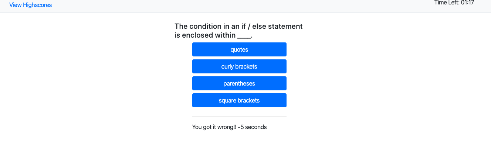

# code-quiz

## Summary 
This webpage is a coding quiz! As you play the quiz you will notified if you get the answer right or wrong. You also get to sore your score and see all the high scores of the game. 

## Link to site
https://ken-bains.github.io/code-quiz/

## Site Picture



## Technologies Used
- HTML - used to create elements on the DOM
- CSS - styles html elements on page
- Git - version control system to track changes to source code
- GitHub - hosts repository that can be deployed to GitHub Pages
- Bootstrap - front-end framework used to create modern websites and web apps.

## Code Snippet
```html
<body>
    <header class="navbar-light bg-light mb-4 border-bottom">
        <div class="row">
            <div class="col-sm-6 justify-content-left">
                <button type="button" class="btn btn-link ml-5" id="viewHighscoreBtn">View Highscores</button>
            </div>
            <div class="col-sm-6 text-right">
               <p>Time Left: <span class="mr-5" id="timerSpan">01:30</span></p> 
            </div>
        </div>
    </header>

    <div class="container">
        <div class="row justify-content-center">
            <div class="col-sm-3">
                <button type="button" class="btn btn-primary btn-block startBtn">Start</button>
            </div>
        </div>


        <div id="questionsWrapper">
            <div class="row justify-content-center">
                <div class="col-sm-4" id="questionDiv"></div>
            </div>
            <div class="row justify-content-center buttonQuestions hideClass">
                <div class="col-sm-3"></div>
            </div>
            <div class="row justify-content-center">
                <div class="col-sm-3" id="answerCheckDiv"></div>
            </div>
        </div>
```
- The code snipit above is an example of code that was used to create the navbar and question answers. 


## Author Links
[LinkedIn](http://www.linkedin.com/in/ken-bains)
[GitHub](https://github.com/ken-Bains)
